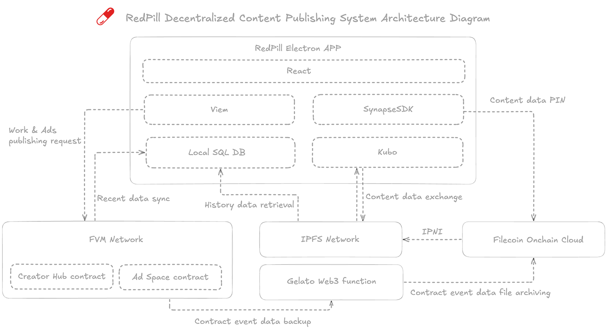

# 

 
 RedPill 

> **Decentralized Content Publishing. Truly Data Sovereign. No Gatekeepers.**

> 🕒 Expected to deploy on Filecoin mainnet at the end of April 2026

RedPill is a desktop-native content publishing system that bridges the gap between Web2 ease-of-use and Web3 data sovereignty. Built on **IPFS**, **Filecoin**, and **FVM**.

## Architecture

## ✨ Features

-   **Zero-Config IPFS:** Built-in Kubo node. Open the app, and you're part of the decentralized web.
-   **Creator First:** 99% of tips go to the creator's wallet.
-   **Decentralized Ad Market:** Auction-based ad spaces managed by FVM smart contracts.
-   **Permanent Archives:** Integrated with Filecoin Onchain Cloud (FOC) for resilient, long-term data availability.
-   **Privacy Centric:** Browse anonymously. Your data, your keys, your identity.

## 🏗️ Tech Stack

-   **Runtime:** Electron (Desktop Native)
-   **Frontend:** React + TailwindCSS
-   **Blockchain:** Viem + FVM (Solidity)
-   **P2P Network:** Kubo (IPFS)
-   **SDKs:** SynapseSDK (Filecoin Integration), Gelato (Automation)

## 🚀 Getting Started

### Prerequisites
-   Node.js (v23+)
-   Yarn or NPM
